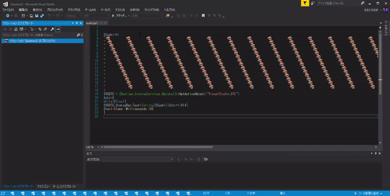
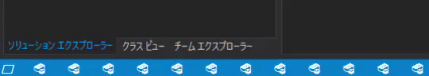

# VisualStudioSUSHI
---------------------

## Overview
-----
Your VisualStudio status bar will be a awesome SUSHI BAR  
  

## How to use
-----
1. Launch Visual Studio
1. Execute "sushi.ps1" in Powershell like this `PS > sushi.ps1`
1. SUSHI BAR
